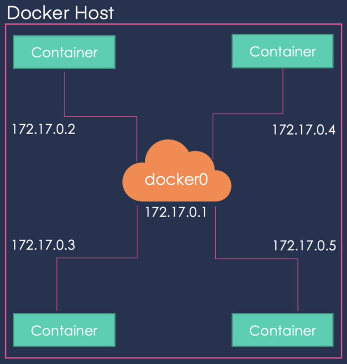

# Lab: Docker Containers

This tutorial aims to be the one-stop shop for getting your hands dirty with Docker. Apart from demystifying the Docker landscape, it'll give you hands-on experience with building and deploying your own webapps on the Cloud. 

## Background

### What is Docker?

Docker is a tool that allows developers, sys-admins etc. to easily deploy their applications in a sandbox (called containers) to run on the host operating system i.e. Linux. The key benefit of Docker is that it allows users to package an application with all of its dependencies into a standardized unit for software development. Unlike virtual machines, containers do not have high overhead and hence enable more efficient usage of the underlying system and resources.

### What are containers?

The industry standard today is to use Virtual Machines (VMs) to run software applications. VMs run applications inside a guest Operating System, which runs on virtual hardware powered by the server’s host OS.

<figure>
  <p align="center"></p>
  <figcaption><p align="center">Figure. Virtualization vs. Containers</p></figcaption>
</figure>

VMs are great at providing full process isolation for applications: there are very few ways a problem in the host operating system can affect the software running in the guest operating system, and vice-versa. But this isolation comes at great cost — the computational overhead spent virtualizing hardware for a guest OS to use is substantial.

Containers take a different approach: by leveraging the low-level mechanics of the host operating system, containers provide most of the isolation of virtual machines at a fraction of the computing power.

### Why use containers?

Containers offer a logical packaging mechanism in which applications can be abstracted from the environment in which they actually run. This decoupling allows container-based applications to be deployed easily and consistently, regardless of whether the target environment is a private data center, the public cloud, or even a developer’s personal laptop. This gives developers the ability to create predictable environments that are isolated from the rest of the applications and can be run anywhere.

From an operations standpoint, apart from portability containers also give more granular control over resources giving your infrastructure improved efficiency which can result in better utilization of your compute resources.

Due to these benefits, containers (& Docker) have seen widespread adoption. Companies like Google, Facebook, Netflix and Salesforce leverage containers to make large engineering teams more productive and to improve utilization of compute resources. In fact, Google credited containers for eliminating the need for an entire data center.

## Setting up your computer

Getting all the tooling setup on your computer can be a daunting task, but thankfully as Docker has become stable, getting Docker up and running on your favorite OS has become very easy. The getting started guide on Docker has detailed instructions for setting up Docker on [Mac](https://docs.docker.com/docker-for-mac/install), [Linux](https://docs.docker.com/install/linux/docker-ce/ubuntu) and [Windows](https://docs.docker.com/docker-for-windows/install).

Before you install Docker Engine for the first time on a new host machine, you need to set up the Docker repository. Afterward, you can install and update Docker from the repository.

### Set up the repository

1. Update the ``apt`` package index and install packages to allow apt to use a repository over HTTPS:

```
$ sudo apt-get update
$ sudo apt-get install \
   apt-transport-https \
   ca-certificates \
   curl \
   gnupg \
   lsb-release
```

2. Add Docker’s official GPG key:

```
$  curl -fsSL https://download.docker.com/linux/ubuntu/gpg | sudo gpg --dearmor -o /usr/share/keyrings/docker-archive-keyring.gpg
```

3. Use the following command to set up the stable repository. To add the nightly or test repository, add the word nightly or test (or both) after the word stable in the commands below. Learn about nightly and test channels.

```
$ echo \
  "deb [arch=amd64 signed-by=/usr/share/keyrings/docker-archive-keyring.gpg] https://download.docker.com/linux/ubuntu \
  $(lsb_release -cs) stable" | sudo tee /etc/apt/sources.list.d/docker.list > /dev/null
```

### Install Docker Engine

Update the ``apt`` package index, and install the latest version of Docker Engine and containerd:

```
$ sudo apt-get update
$ sudo apt-get install docker-ce docker-ce-cli containerd.io
```

Verify that Docker Engine is installed correctly by running the hello-world image.


```
$ sudo docker run hello-world
Unable to find image 'hello-world:latest' locally
latest: Pulling from library/hello-world
03f4658f8b78: Pull complete
a3ed95caeb02: Pull complete
Digest: sha256:8be990ef2aeb16dbcb9271ddfe2610fa6658d13f6dfb8bc72074cc1ca36966a7
Status: Downloaded newer image for hello-world:latest

Hello from Docker.
This message shows that your installation appears to be working correctly.
...
```

## Running your first container

### Playing with Busybox

Now that we have everything setup, it's time to get our hands dirty. In this section, we are going to run a [Busybox](https://en.wikipedia.org/wiki/BusyBox) container on our system and get a taste of the docker run command.

To get started, let's run the following in our terminal:

```
$ sudo docker pull busybox
Using default tag: latest
latest: Pulling from library/busybox
b71f96345d44: Pull complete
Digest: sha256:0f354ec1728d9ff32edcd7d1b8bbdfc798277ad36120dc3dc683be44524c8b60
Status: Downloaded newer image for busybox:latest
docker.io/library/busybox:latest
```

The ``pull`` command fetches the busybox [image](https://hub.docker.com/_/busybox/) from the [Docker registry](https://hub.docker.com/explore/) and saves it to our system. You can use the ``docker images`` command to see a list of all images on your system.

```
$ sudo docker images
REPOSITORY    TAG       IMAGE ID       CREATED        SIZE
busybox       latest    69593048aa3a   2 months ago   1.24MB
hello-world   latest    d1165f221234   5 months ago   13.3kB
```

### Docker Run
Great! Let's now run a Docker container based on this image. To do that we are going to use the almighty docker run command.

```
$ sudo docker run busybox
$
```

Wait, nothing happened! Is that a bug? Well, no. Behind the scenes, a lot of stuff happened. When you call run, the Docker client finds the image (busybox in this case), loads up the container and then runs a command in that container. When we run docker run busybox, we didn't provide a command, so the container booted up, ran an empty command and then exited. Well, yeah - kind of a bummer. Let's try something more exciting.

```
$ sudo docker run busybox echo "hello from busybox"
hello from busybox
```

Nice - finally we see some output. In this case, the Docker client dutifully ran the echo command in our busybox container and then exited it. If you've noticed, all of that happened pretty quickly. Imagine booting up a virtual machine, running a command and then killing it. Now you know why they say containers are fast! Ok, now it's time to see the ``docker ps`` command. The ``docker ps`` command shows you all containers that are currently running.

```
$ sudo docker ps
CONTAINER ID        IMAGE               COMMAND             CREATED             STATUS              PORTS               NAMES
```

Since no containers are running, we see a blank line. Let's try a more useful variant: ``docker ps -a``

```
$ sudo docker ps -a
CONTAINER ID   IMAGE         COMMAND                  CREATED          STATUS                      PORTS     NAMES
91b65e8f1238   busybox       "echo 'hello from bu…"   6 seconds ago    Exited (0) 5 seconds ago              quizzical_wu
64f4be93f02f   busybox       "echo"                   28 seconds ago   Exited (0) 27 seconds ago             modest_jennings
8066017b4c27   hello-world   "/hello"                 57 minutes ago   Exited (0) 57 minutes ago             thirsty_carver
```

So what we see above is a list of all containers that we ran. Do notice that the STATUS column shows that these containers exited a few minutes ago.

You're probably wondering if there is a way to run more than just one command in a container. Let's try that now:

```
$ sudo docker run -it busybox sh
/ # ls
bin   dev   etc   home  proc  root  sys   tmp   usr   var
/ # uptime
 09:30:30 up  1:10,  0 users,  load average: 0.02, 0.00, 0.00
```

Running the run command with the -it flags attaches us to an interactive tty in the container. Now we can run as many commands in the container as we want. Take some time to run your favorite commands.

> ***Danger Zone***: If you're feeling particularly adventurous you can try rm -rf bin in the container. Make sure you run this command in the container and not in your laptop/desktop. Doing this will make any other commands like ls, uptime not work. Once everything stops working, you can exit the container (type exit and press Enter) and then start it up again with the docker run -it busybox sh command. Since Docker creates a new container every time, everything should start working again.

That concludes a whirlwind tour of the mighty ``docker run`` command, which would most likely be the command you'll use most often. It makes sense to spend some time getting comfortable with it. To find out more about ``run``, use ``docker run --help`` to see a list of all flags it supports. As we proceed further, we'll see a few more variants of ``docker run``.

Before we move ahead though, let's quickly talk about deleting containers. We saw above that we can still see remnants of the container even after we've exited by running ``docker ps -a``. Throughout this tutorial, you'll run ``docker run`` multiple times and leaving stray containers will eat up disk space. Hence, as a rule of thumb, I clean up containers once I'm done with them. To do that, you can run the ``docker rm`` command. Just copy the container IDs from above and paste them alongside the command.

```
$ sudo docker rm 91b65e8f1238 64f4be93f02f
91b65e8f1238
64f4be93f02f
```

On deletion, you should see the IDs echoed back to you. If you have a bunch of containers to delete in one go, copy-pasting IDs can be tedious. In that case, you can simply run:

```
$ sudo docker rm $(docker ps -a -q -f status=exited)
```

This command deletes all containers that have a status of ``exited``. In case you're wondering, the ``-q`` flag, only returns the numeric IDs and ``-f`` filters output based on conditions provided. One last thing that'll be useful is the ``--rm`` flag that can be passed to ``docker run`` which automatically deletes the container once it's exited from. For one off docker runs, ``--rm`` flag is very useful.

In later versions of Docker, the ``docker container prune`` command can be used to achieve the same effect.

```
$ sudo docker container prune
WARNING! This will remove all stopped containers.
Are you sure you want to continue? [y/N] y
Deleted Containers:
5b4cc273f5384097fa726607ff1e31b55f232c65106b8ed35bc279299d38f420
ed3c4c1161ca558aebabd04af40c13051b2507b5b495c14400c763b90709fd67
8066017b4c2759df78e88b156584b885a0554ed15d5ce615c7a0ae698111e87c

Total reclaimed space: 15B
```

Lastly, you can also delete images that you no longer need by running ``docker rmi``.

## Terminology

In the last section, we used a lot of Docker-specific jargon which might be confusing to some. So before we go further, let me clarify some terminology that is used frequently in the Docker ecosystem.

- *Images* - The blueprints of our application which form the basis of containers. In the demo above, we used the ``docker pull`` command to download the busybox image.
- *Containers* - Created from Docker images and run the actual application. We create a container using ``docker run`` which we did using the busybox image that we downloaded. A list of running containers can be seen using the ``docker ps`` command.
- *Docker Daemon* - The background service running on the host that manages building, running and distributing Docker containers. The daemon is the process that runs in the operating system which clients talk to.
- *Docker Client* - The command line tool that allows the user to interact with the daemon. More generally, there can be other forms of clients too - such as Kitematic which provide a GUI to the users.
- *Docker Hub* - A [registry](https://hub.docker.com/explore/) of Docker images. You can think of the registry as a directory of all available Docker images. If required, one can host their own Docker registries and can use them for pulling images.

## Webapps with Docker 

Great! So we have now looked at ``docker run``, played with a Docker container and also got a hang of some terminology. Armed with all this knowledge, we are now ready to get to the real-stuff, i.e. deploying web applications with Docker!

### Static Sites
Let's start by taking baby-steps. The first thing we're going to look at is how we can run a dead-simple static website. We're going to pull a Docker image from Docker Hub, run the container and see how easy it is to run a webserver.

The image that you are going to use is a single-page website that was already created for this demo and is available on the registry - ``prakhar1989/static-site``. You
can download and run the image directly in one go using ``docker run``. As noted above, the ``--rm`` flag automatically removes the container when it exits.

```
$ sudo docker run --rm dockersamples/static-site
```

Since the image doesn't exist locally, the client will first fetch the image from the registry and then run the image. If all goes well, you should see a ``Nginx is running...`` message in your terminal. Okay now that the server is running, how to see the website? What port is it running on? And more importantly, how do we access the container directly from our host machine? Hit Ctrl+C to stop the container.

Well, in this case, the client is not exposing any ports so we need to re-run the ``docker run`` command to publish ports. While we're at it, we should also find a way so that our terminal is not attached to the running container. This way, you can happily close your terminal and keep the container running. This is called detached mode.

```
$ sudo docker run -d -P --name static-site prakhar1989/static-site
e1978de1b3e9cf3288c441aca4f29c8946f27fbdf0584bbfcebc8659ab8c21aa
```

In the above command, ``-d`` will detach our terminal, ``-P`` will publish all exposed ports to random ports and finally ``--name`` corresponds to a name we want to give. Now we can see the ports by running the ``docker port [CONTAINER]`` command

```
$ sudo docker port static-site
443/tcp -> 0.0.0.0:49153
80/tcp -> 0.0.0.0:49154
```

More specifically, what the above run command does is start a new container based on the ``static-site`` image. Docker sets up its own internal networking (with its own set of IP addresses) to allow the Docker daemon to communicate with the host and to allow containers within Docker to communicate with one another. This internal network is illustrated below:

<figure>
  <p align="center"></p>
  <figcaption><p align="center">Figure. Default network</p></figcaption>
</figure>


As shown above, each container, like our static-site container, has its own IP address. On this container, the Nginx web server is running and serves a static website. The web server on the container opens two ports: port 80 for non-secure (http) connections and port 443 for secure (https) connections. These two ports, 80 and 443, are not accessible from outside the Docker (i.e. from the machine which is the Docker Host). So basically, what you're doing with the ``-P`` flag is to connect Docker's internal network with the "external" network, that is the ``-P`` option maps an external port on the host to an internal port on the container. The docker port command reveals that the external host port 49153 forwards requests (connects) to internal port 443 and the external port 49154 to internal port 80 on the container.

You can now open ``http://<YOUR_IPADDRESS>:[YOUR_PORT_FOR 80/tcp]`` to see your site live! You can use ``hostname`` to find your IP address:

```
$ hostname -i
```

You can also specify a custom port to which the client will forward connections to the container.

```
$ sudo docker run -p 8888:80 prakhar1989/static-site
Nginx is running...
```

<figure>
  <p align="center"></p>
  <figcaption><p align="center">Figure. Hello Docker</p></figcaption>
</figure>


To stop a detached container, run docker stop by giving the container ID. In this case, we can use the name static-site we used to start the container.

```
$ sudo docker stop static-site
static-site
```

I'm sure you agree that was super simple. To deploy this on a real server you would just need to install Docker, and run the above Docker command. Now that you've seen how to run a webserver inside a Docker image, you must be wondering - how do I create my own Docker image? This is the question we'll be exploring in the next section.

## Docker Images

We've looked at images before, but in this section we'll dive deeper into what Docker images are and build our own image! Lastly, we'll also use that image to run our application locally. Excited? Great! Let's get started.

Docker images are the basis of containers. In the previous example, we pulled the Busybox image from the registry and asked the Docker client to run a container based on that image. To see the list of images that are available locally, use the ``docker images`` command.

```
$ sudo docker images
REPOSITORY                  TAG       IMAGE ID       CREATED        SIZE
busybox                     latest    69593048aa3a   2 months ago   1.24MB
hello-world                 latest    d1165f221234   5 months ago   13.3kB
prakhar1989/static-site     latest    f01030e1dcf3   5 years ago    134MB
```

The above gives a list of images that I've pulled from the registry, along with ones that I've created myself (we'll shortly see how). The ``TAG`` refers to a particular snapshot of the image and the ``IMAGE ID`` is the corresponding unique identifier for that image.

For simplicity, you can think of an image akin to a git repository - images can be [committed](https://docs.docker.com/engine/reference/commandline/commit/) with changes and have multiple versions. If you don't provide a specific version number, the client defaults to ``latest``. For example, you can pull a specific version of ``ubuntu`` image

```
$ sudo docker pull ubuntu:18.04
```

To get a new Docker image you can either get it from a registry (such as the Docker Hub) or create your own. There are tens of thousands of images available on Docker Hub. You can also search for images directly from the command line using ``docker search``.

An important distinction to be aware of when it comes to images is the difference between base and child images.
- Base images are images that have no parent image, usually images with an OS like ubuntu, busybox or debian.
- Child images are images that build on base images and add additional functionality.

Then there are official and user images, which can be both base and child images.
- Official images are images that are officially maintained and supported by the folks at Docker. These are typically one word long. In the list of images above, the ``python``, ``ubuntu``, ``busybox`` and ``hello-world`` images are official images.
- User images are images created and shared by users like you and me. They build on base images and add additional functionality. Typically, these are formatted as ``user/image-name``.

### Our First Image

Now that we have a better understanding of images, it's time to create our own. Our goal in this section will be to create an image that sandboxes a simple Flask application. For the purposes of this workshop, I've already created a fun little Flask app that displays a random cat ``.gif`` every time it is loaded - because you know, who doesn't like cats? If you haven't already, please go ahead and clone the repository locally like so

```
$ git clone https://github.com/prakhar1989/docker-curriculum.git
$ cd docker-curriculum/flask-app
```

> This should be cloned on the machine where you are running the docker commands and not inside a docker container.

The next step now is to create an image with this web app. As mentioned above, all user images are based on a base image. Since our application is written in Python, the base image we're going to use will be [Python 3](https://hub.docker.com/_/python/).

### Dockerfile

A [Dockerfile](https://docs.docker.com/engine/reference/builder/) is a simple text file that contains a list of commands that the Docker client calls while creating an image. It's a simple way to automate the image creation process. The best part is that the [commands](https://docs.docker.com/engine/reference/builder/#from) you write in a Dockerfile are *almost* identical to their equivalent Linux commands. This means you don't really have to learn new syntax to create your own dockerfiles.

The application directory does contain a Dockerfile but since we're doing this for the first time, we'll create one from scratch. To start, create a new blank file in our favorite text-editor and save it in the same folder as the flask app by the name of ``Dockerfile``.

We start with specifying our base image. Use the ``FROM`` keyword to do that

```
FROM python:3
```

The next step usually is to write the commands of copying the files and installing the dependencies. First, we set a working directory and then copy all the files for our app.

```
# set a directory for the app
WORKDIR /usr/src/app

# copy all the files to the container
COPY . .
```

Now, that we have the files, we can install the dependencies.

```
# install dependencies
RUN pip install --no-cache-dir -r requirements.txt
```

The next thing we need to specify is the port number that needs to be exposed. Since our flask app is running on port ``5000``, that's what we'll indicate.

```
EXPOSE 5000
```

The last step is to write the command for running the application, which is simply - ``python ./app.py``. We use the CMD command to do that -

```
CMD ["python", "./app.py"]
```

The primary purpose of ``CMD`` is to tell the container which command it should run when it is started. With that, our ``Dockerfile`` is now ready. This is how it looks -

```
FROM python:3

# set a directory for the app
WORKDIR /usr/src/app

# copy all the files to the container
COPY . .

# install dependencies
RUN pip install --no-cache-dir -r requirements.txt

# define the port number the container should expose
EXPOSE 5000

# run the command
CMD ["python", "./app.py"]
```

Now that we have our Dockerfile, we can build our image. The docker build command does the heavy-lifting of creating a Docker image from a Dockerfile. 

The docker build command is quite simple - it takes an optional tag name with -t and a location of the directory containing the Dockerfile.

```
$ sudo docker build -t catnip .
Sending build context to Docker daemon  8.704kB
Step 1/6 : FROM python:3
 ---> 1e76b28bfd4e
Step 2/6 : WORKDIR /usr/src/app
 ---> Using cache
 ---> 735213de06dd
Step 3/6 : COPY . .
 ---> Using cache
 ---> 7b77615c23c0
Step 4/6 : RUN pip install --no-cache-dir -r requirements.txt
 ---> Using cache
 ---> 51f8c18b2866
Step 5/6 : EXPOSE 5000
 ---> Using cache
 ---> 73ec26b25fc6
Step 6/6 : CMD ["python", "./app.py"]
 ---> Using cache
 ---> d5158178b1a7
Successfully built d5158178b1a7
Successfully tagged catnip:latest
```

If you don't have the ``python:3`` image, the client will first pull the image and then create your image. Hence, your output from running the command will look different from mine. If everything went well, your image should be ready! Run ``docker images`` and see if your image shows.

The last step in this section is to run the image and see if it actually works.

```
$ sudo docker run -p 8888:5000 catnip
 * Running on http://0.0.0.0:5000/ (Press CTRL+C to quit)
```

The command we just ran used port 5000 for the server inside the container and exposed this externally on port 8888. Head over to the URL with port 8888, where your app should be live.

<figure>
  <p align="center"></p>
  <figcaption><p align="center">Figure. Catnip</p></figcaption>
</figure>

Congratulations! You have successfully created your first docker image.

## Acknowledgements

This lab tutorial is adapted from [Docker for Beginners](https://docker-curriculum.com/), written and developed by Prakhar Srivastav.
