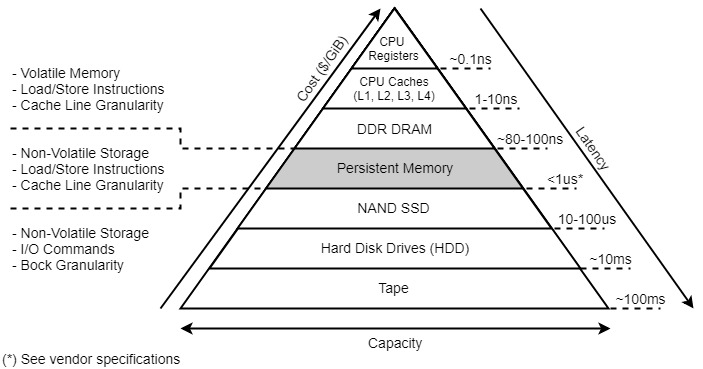

# Lab: Benchmarking and Learning Persistent Memory

This lab tutorial will introduce you to [Persistent Memory](https://www.snia.org/education/what-is-persistent-memory), a new non-volatile memory technology that aims to transform the data landscape.

## Background

### Technology Overview

Persistent memory (or PMem) is a new type of memory technology that retains its content through power cycles and can be used as top-tier storage, which is why you may hear people refer to PMem as "storage-class memory" or SCM. 

<figure>
  <p align="center"></p>
  <figcaption><p align="center"><b>Figure</b>. Memory-storage hierarchy with Persistent Memory tier (Source: <a href="https://docs.pmem.io/">Persistent Memory Documentation</a>)</p></figcaption>
</figure>

Persistent memory provides a new entry in the memory-storage hierarchy that fills the performance/capacity gap. It's slower than DRAM, but provides higher throughput than SSD. Compared to DRAM, persistent memory modules come in much larger capacities and are less expensive per GB, however they are still more expensive than SSD. Memory contents remain even when system power goes down in the event of an unexpected power loss, user initiated shutdown, or system crash. This means that you can use persistent memory modules as ultra-fast, persistent storage. 

<figure>
  <p align="center"></p>
  <figcaption><p align="center"><b>Figure</b>. Intel Optane DC Persistent Memory Module</p></figcaption>
</figure>

[Intel Optane DC Persistent Memory (DCPMM)](https://www.intel.com/content/www/us/en/architecture-and-technology/optane-dc-persistent-memory.html) is a data center product designed for Intel servers which fits into standard DIMM slots alongside DDR4 DRAM memory modules. The underlying technology is based on an undisclosed material that changes its resistance in order to store bits of information. The key fact is that it is unrelated to the way that DRAM or flash memory is manufactured and does not rely on transistors or capacitors to store charge. This is why it has such different characteristics.

Intel Optane DC Persistent Memory supports both Memory (volatile) and App Direct (persistent) operating modes. To use persistent memory modules as storage, which is the primary use case for server workloads, you must use App Direct mode. Memory mode essentially uses persistent memory as slower RAM, which doesn't usually meet the performance requirements of server workloads. 

### Programming Model Overview

The [Storage Network Industry Association (SNIA)](http://www.snia.org/) and several technology industry companies derived several standards, including the [NVM Programming Model](https://www.snia.org/tech_activities/standards/curr_standards/npm), to enable application development for persistent memory. The programming model has its roots in earlier work on persistent memory that was [published](https://dl.acm.org/doi/abs/10.1145/1961295.1950379) in academic research in 2011.

<figure>
  <p align="center"></p>
  <figcaption><p align="center"><b>Figure</b>. SNIA NVM Programming Model (Source: <a href="https://docs.pmem.io/">Persistent Memory Documentation</a>)</p></figcaption>
</figure>

The figure above shows the NVM Programming Model which describes how applications can access persistent memory devices (NVDIMMs) using traditional POSIX standard APIs such as read, write, pread, and pwrite, or load/store operations such as memcpy when the data is memory mapped to the application. The 'Persistent Memory' area describes the fastest possible access because the application I/O bypasses existing filesystem page caches and goes directly to/from the persistent memory media.

The [Persistent Memory Development Kit (PMDK)](http://pmem.io/pmdk) is a collection of libraries and tools for System Administrators and Application Developers to simplify managing and accessing persistent memory devices. Tuned and validated on both Linux and Windows, the libraries implement the SNIA NVM Programming Model and build on the Direct Access (DAX) feature which allows applications to directly access persistent memory as memory-mapped files. 

Directly accessing the physical media enables an unprecedented level of storage performance but introduces new programming challenges and paradigms. The PMDK offers application developers many libraries and features to solve some of the more difficult programming issues.

## Benchmarking Persistent Memory

This part introduces you to basic performance measuments of Intel Optane DC Persistent Memory hardware.

You will measure read latency by timing the average latency to random memory accesses to persistent memory using a memory-latency bound pointer-chasing benchmark, called MemLat.
MemLat creates a pointer chain as an array of 64-bit integer elements. 
The contents of each element dictate which one is read next; and each element is read exactly once. 
You need to choose the array size to be much larger than the size of the last-level cache so that each element’s memory access results in a cache miss that is guaranteed to be served from memory.
MemLat is memory-latency sensitive because the next element to be accessed is determined only after the current access completes.

To build MemLat, type the following commands:

```
$ cd src
$ make
```

You will use MemLat to evaluate three different access methods to persistent memory: memory load instructions, file read system calls over DAX, and file read systems calls over a block device. 

### Block device

You need to configure the NVDIMM namespace to use the ```sector``` mode, which presents the storage as a fast block device. 
This mode is useful for legacy applications that have not been modified to use NVDIMM storage, or for applications that make use of the full I/O stack, including Device Mapper.

A sector device can be used in the same way as any other block device on the system. You can create partitions or file systems on it, configure it as part of a software RAID set, or use it as the cache device for dm-cache.

Devices in this mode are available at /dev/pmemNs. See the blockdev value listed after creating the namespace.


<!-- ndctl list

[
  {
    "dev":"namespace3.0",
    "mode":"fsdax",
    "map":"dev",
    "size":133175443456,
    "uuid":"fe72f323-5e15-468c-b175-09a9a21e74fb",
    "sector_size":4096,
    "align":2097152,
    "blockdev":"pmem3"
  },
  {
    "dev":"namespace2.0",
    "mode":"fsdax",
    "map":"mem",
    "size":135289372672,
    "uuid":"71fb8264-9222-4e30-a867-f9f1826fcbc6",
    "sector_size":512,
    "align":2097152,
    "blockdev":"pmem2"
  }
] -->

To configure the NVDIMM as a block device, type the following command:

```
$ sudo ndctl create-namespace --force --reconfig=namespace3.0 --mode=sector
```

Then, to create a file system on it:

```
sudo mkfs -t xfs /dev/pmem3s
sudo mount -o dax /dev/pmem3s /mnt/pmem3/
```

Now you are ready to use MemLat to measure access latency to Optane. 

First, create a chain comprising one million elements, with element size of 4096 bytes:

```
sudo ./lat /mnt/pmem3/test 1 1000000 4096 4096 c
```

Then, run the latency test using direct file I/O:

```
sudo ./lat /mnt/pmem3/test 1 1000000 4096 4096 d
```

Direct file I/O makes an effort to transfer data synchronously without caching data in the OS page cache.

Alternatively, you can run the latency test using regular file I/O that caches data in the OS page cache. 
To ensure that file reads reach the Optane device, you need to ensure that the OS page cache doesn't hold any previously cached data. 

<!-- 2070 -->

```
echo 1 | sudo tee /proc/sys/vm/drop_caches
```

```
sudo ./lat /mnt/pmem3/test 1 1000000 4096 4096 f
```

<!-- 2679 -->

When you repeat the measurement without clearing the OS page cache, you will notice a lower access latency. This is because file reads hit the OS page cache and avoid a trip to Optane.

```
sudo ./lat /mnt/pmem3/test 1 1000000 4096 4096 f
```

<!-- 852 -->

### File System Direct Access (DAX)

You need to configure the NVDIMM namespace to use the ```fsdax``` mode.
This mode enables NVDIMM devices to support direct access programming as described in the Storage Networking Industry Association (SNIA) Non-Volatile Memory (NVM) Programming Model specification. 
In this mode, I/O bypasses the storage stack of the kernel, and many Device Mapper drivers therefore cannot be used.

You can create file systems on file system DAX devices.

Devices in this mode are available at /dev/pmemN. See the blockdev value listed after creating the namespace.

To configure the NVDIMM as a DAX device, type the following commands:

```
sudo ndctl create-namespace --force --reconfig=namespace3.0 --mode=fsdax
```

Then, to create a file system on it:

```
sudo mkfs -t xfs /dev/pmem3
sudo mount -o dax /dev/pmem3 /mnt/pmem3/
```

Now you are ready to use MemLat to measure access latency to Optane. 

First, create a chain comprising one million elements, with element size of 4096 bytes:

```
sudo ./lat /mnt/pmem3/test 1 1000000 4096 4096 c
```

Then, run the latency test using file read system calls:

```
sudo ./lat /mnt/pmem3/test 1 1000000 4096 4096 f
```

<!-- 1991 -->

Repeat the latency test using load instructions instead of read system calls:

```
sudo ./lat /mnt/pmem3/test 1 1000000 4096 4096 m
```

<!-- 1274 -->

You should observe a lower access latency when using load instructions. The performance benefit of load instructions over read system calls gets even larger when the access size is smaller:

```
sudo ./lat /mnt/pmem3/test 1 1000000 4096 8 f
```

<!-- 1163 -->

```
sudo ./lat /mnt/pmem3/test 1 1000000 4096 8 m
```

<!-- 439 -->

## Programming Persistent Memory

This part introduces you to programming with persistent, byte-addressable memory using the ``pmemobj`` library of the [Persistent Memory Development Kit (PMDK)](http://pmem.io/pmdk). We will go over several of the available features, implement an example application and learn something about the inner workings of libpmemobj. 

### Memory pools

If you’ve read the overview you know that persistent memory is exposed by the OS as memory-mapped files, we call them pools.

The ``pmemobj`` library provides an interface to easily manage those pools, so that you don’t have to manually create the files or ``mmap`` them. Creating a pool is done using the ``pmemobj_create`` API function, which takes the usual parameters you would expect for a function creating a file plus a ``layout``, which is a string of your choosing that identifies the pool. It is required that the ``layout`` you pass to ``pmemobj_open`` matches the one the pool was created with. As with any other OS resource, you have to release the pool using pmemobj_close when the persistent memory pool is no longer needed, usually at the end of the application. To verify the integrity of the pool there’s a ``pmemobj_check`` function that verifies if all the required metadata is consistent.

### Persistent pointers

Now that we have the memory region mapped, how can one access it? Let’s think about regular pointers for a second. Boiling it down to the very basics, a pointer is a number of bytes between the start of the virtual address space to the beginning of the thing it points to. And now to translate this to persistent memory. Note that you can have more than one pool open in one application, the persistent pointer is twice the size of a regular pointer and contains the offset from the start of the pool (not the VAS) and unique id of the pool. The structure itself looks like this:

```C
typedef struct pmemoid {
	uint64_t pool_uuid_lo;
	uint64_t off;
} PMEMoid;
```

If you know the virtual address the pool is mapped at, a simple addition can be performed to get the direct pointer, like this: ``(void *)((uint64_t)pool + oid.off)`` and this is exactly what the ``pmemobj_direct`` does, it takes the ``PMEMoid`` (persistent pointer) and turns it into a regular one that can be dereferenced. The pool id is used to figure out where the pool is currently mapped (because the actual address of the memory mapped region can be different each time you start your application). How exactly does the figuring out work? All open pools are stored in a [cuckoo hash table](https://en.wikipedia.org/wiki/Cuckoo_hashing) with 2 hashing functions, so it means that when you call ``pmemobj_direct`` a maximum of two table lookups will happen to locate the pool address.

### The root object

Think about following scenario:

```
- allocate a block of persistent memory (let's assume a malloc-like interface)
- write a string to it
- close the application
```

How do you locate the pointer which contains your string? The data you want will be somewhere in the pool, but apart from scanning the entire file for matching characters you can’t really find it. You could, for example, pick a random offset into the pool and treat it as a known address. But that would be wrong, like writing randomly in the virtual address space wrong - it would most likely unintentionally overwrite something. The known location you can always look for in the memory pool is the root object. It’s the anchor to which all the memory structures can be attached. In a case where all you really need is one, not dynamically changing, data structure you can just solely rely on the root object. The ``size`` in the ``pmemobj_root`` function is the size of the structure you want as root object, so typically you might want to write something like this:

```C
PMEMoid root = pmemobj_root(pop, sizeof (struct my_root));
```

The root object is initially zeroed, so there is no need to worry about initialization. Also, if you want to resize your object, you are free to do so just by passing different size to the function - so when you add a new variable to your structure there’s no need to worry. The new region will also be initially zeroed. Keep in mind that the root object is allocated from the pool and when an in-place reallocation is impossible a new object will be created with a different offset, so don’t store the root persistent pointer anywhere without really thinking it through.

### Safely storing data

All of the previous information was about where to store data, it’s time to learn how. Consider the following example:

```C
void set_name(const char *my_name) {
  memcpy(root->name, my_name, strlen(my_name));
}
```

This would be a perfectly valid code if the ``root`` variable were volatile, but if it’s persistent the outcome of this function is not deterministic. Remember that the memory survives application crashes. When creating programs that write to persistent memory we have to be extra careful to make sure that the application is always in a state we can recognize and use, regardless of the exact moment is was interrupted - don’t assume that your application will always gracefully exit, that might be the 99% case but when something unexpected happens you may end up with unrecoverable application state and lose all your data. Ok, let’s get back to the code. Let’s assume that we can recognize a zeroed state of the ``root->name`` variable, so if the application crashes before the ``memcpy`` started all is good. What happens when the application crashes somewhere in the middle of the copying? Well, if your name is Brianna, the actually stored value may be Brian - which is perfectly valid, however not what we wanted. Surely after the copying has finished the program can be interrupted without issues? Well… no. You also have to consider CPU caches and the order in which they are flushed. In this case, your name might become *anna* if the *Bri* part happens to be on a different cacheline that didn’t get flushed in time. So, how to fix all that?

```C
void set_name(const char *my_name) {
  root->length = strlen(my_name);
  pmemobj_persist(&root->length, sizeof (root->length));
  pmemobj_memcpy_persist(root->name, my_name, root->length);
}
```

Notice that here we store the length of the buffer before copying, so when reading we can double-check if the name is correct. The ``_persist`` suffixed functions make sure that the range of memory they operate on is flushed from the CPU and safely stored on the medium, whatever that might be. So, at line 4 we are 100% sure that the ``root->length`` contains what we want. The pmemobj library has way more convenient methods of doing this, like transactions, but knowing the basics can help in understanding the more advanced techniques.

The fundamental principle is that, on the current hardware architecture, only 8 bytes of memory can be written in an atomic way. So something like this is correct:

```C
root->u64var = 123;
pmemobj_persist(&root->u64var, 8);
```

But following is not:

```C
root->u64var = 123;
root->u32var = 321;
pmemobj_persist(&root->u64var, 12);
```

And that’s the gist of the persistent memory programming.

### Example

Now that we have learned some valuable knowledge, let’s put it to use. Remember the string example I’ve talked previously? Seems like a good point to start. As a reminder: we will write 2 applications, one that writes a string to memory and one that reads that exact same string - but only if it was properly written.

For both of the programs, we will need this set of includes:

```C
#include <stdio.h>
#include <string.h>
#include <libpmemobj.h>
#include "layout.h"
```

As a general rule you don’t need **libpmem** when using **libpmemobj**, the latter provides all the required functionality. The ``layout.h`` file has the declaration of stuff we will need for both ``.c`` files:

```C
#define LAYOUT_NAME "intro_0" /* will use this in create and open */
#define MAX_BUF_LEN 10 /* maximum length of our buffer */

struct my_root {
	size_t len; /* = strlen(buf) */
	char buf[MAX_BUF_LEN];
};
```

First, we will create [writer.c](https://github.com/pmem/pmdk/blob/48c00c95ba849b5347cadba475e0e0eab0aac8ab/src/examples/libpmemobj/string_store/writer.c) which will do the first part of the work:

```C
int main(int argc, char *argv[])
{
	PMEMobjpool *pop = pmemobj_create(argv[1], LAYOUT_NAME, PMEMOBJ_MIN_POOL, 0666);
	if (pop == NULL) {
		perror("pmemobj_create");
		return 1;
	}

	...

	pmemobj_close(pop);
	return 0;
}
```

Here we create the pool file with the name from the first argument. Don’t forget to use proper file mode in ``pmemobj_create`` or you will end up with pool you cannot open or modify.

```C
PMEMoid root = pmemobj_root(pop, sizeof (struct my_root));
struct my_root *rootp = pmemobj_direct(root);
```

Next we request the root object and translate it to a usable, direct pointer. Because this is done just after creating the pool we can be sure that the ``struct my_root`` pointed to by root is zeroed.

```
char buf[MAX_BUF_LEN];
scanf("%9s", buf);
```

We read maximum of 9 bytes to the temporary buffer.

```C
rootp->len = strlen(buf);
pmemobj_persist(pop, &rootp->len, sizeof (rootp->len));
pmemobj_memcpy_persist(pop, rootp->buf, my_buf, rootp->len);
```

And we write this buffer to persistence. This snippet should be clear as day by now.

It’s time for the [reader.c](https://github.com/pmem/pmdk/blob/48c00c95ba849b5347cadba475e0e0eab0aac8ab/src/examples/libpmemobj/string_store/reader.c), the code is very similar up to the scanf line.

```C
int main(int argc, char *argv[])
{
	PMEMobjpool *pop = pmemobj_open(argv[1], LAYOUT_NAME);
	if (pop == NULL) {
		perror("pmemobj_open");
		return 1;
	}

	PMEMoid root = pmemobj_root(pop, sizeof (struct my_root));
	struct my_root *rootp = pmemobj_direct(root);

	...

	pmemobj_close(pop);

	return 0;
}
```

This time when we open the pool, the root object will not be zeroed - it will contain whatever string the writer was tasked with storing. So, to read it:

```C
if (rootp->len == strlen(rootp->buf))
	printf("%s\n", rootp->buf);
```

You should now be able to compile both applications and verify that they do what was advertised.

The complete source code for this example (and more) can be found in the [PMDK repository](https://github.com/pmem/pmdk/tree/48c00c95ba849b5347cadba475e0e0eab0aac8ab/src/examples/libpmemobj/string_store).

## Acknowledgements

The programming tutorial part is based on the blog post [An introduction to pmemobj - new programming model](https://pmem.io/2015/06/12/pmem-model.html) by [pmem.io](https://pmem.io/).

## References

1. [Persistent Memory Quick Start Programming Tutorial](https://www.snia.org/educational-library/persistent-memory-quick-start-programming-tutorial-2016)
2. [Speeding Up I/O Workloads with Intel® Optane™ Persistent Memory Modules](https://www.intel.com/content/www/us/en/developer/articles/technical/speeding-up-io-workloads-with-intel-optane-dc-persistent-memory-modules.html)
